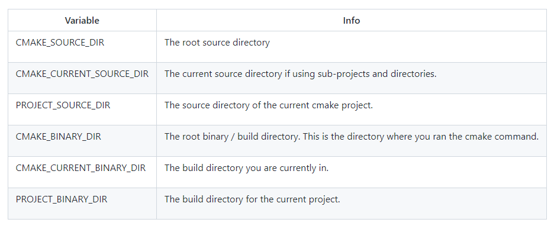

# Cmake学习记录

## 1. 目录路径含义

## 2. 源文件包含（include source files）
* 使用set指令:
~~~
set(SOURCES
    src/Hello.cpp
    src/main.cpp
)
add_executable(${PROJECT_NAME} ${SOURCES})
~~~
* 使用GLOB指令：
~~~
file(GLOB SOURCES "src/*.cpp")
~~~

## 3. 包含头文件目录
* 用处
> 方便.cpp文件识别.h头文件路径

* 有3种不同的scope：
> PRIVATE - the directory is added to this target’s include directories

> INTERFACE - the directory is added to the include directories for any targets that link this library.

> PUBLIC - As above, it is included in this library and also any targets that link this library.

* 例子
~~~
target_include_directories(target
    PRIVATE
        ${PROJECT_SOURCE_DIR}/include
)
~~~
* Tips
> 路径包含到${CMAKE_XXX}/include就行，在cpp文件中包含头文件时加上路径名字
~~~
#include "static/Hello.h"
~~~
## 4. 生成静态链接库
> 生成的静态链接库名称为：libXXX.a
~~~
add_library(hello_library STATIC
    src/Hello.cpp
)
~~~
## 5. 生成动态链接库
> 生成动态链接库名称为：libxxx.so
~~~
add_library(hello_library SHARED
    src/Hello.cpp
)
~~~
## 6. 链接库
> 链接库，生成可执行文件
~~~
add_executable(hello_binary
    src/main.cpp
)

target_link_libraries( hello_binary
    PRIVATE
        hello_library
)
~~~

## 7. cmake设置build type
> 设置CMAKE_BUILD_TYPE
* 可选值包括：
> Debug：用于在没有优化的情况下，使用带有调试符号构建库或可执行文件

> Release：用于构建的优化的库或可执行文件，不包含调试符号

> RelWithDebInfo：由于构建较少的优化库或可执行文件，包含调试符号

> MinSizeRel：用于不增加目标代码大小的优化方式，来构建或可执行文件
* 使用方法
>set(CMAKE_BUILD_TYPE Debug CACHE STRING "set build type to debug")     # CMakeLists.txt中指定
* 或者
> cmake .. -D CMAKE_BUILD_TYPE="Debug"   # 生成时命令行指定

## 8. 第三方库文件
> 系统中安装的第三方库可以通过 find_package 找到，像之前的 libanswer 一样链接：
~~~
find_package(CURL REQUIRED)
target_link_libraries(libanswer PRIVATE CURL::libcurl)
~~~
> REQUIRED 表示 CURL 是必须的依赖，如果没有找到，会报错。

> PRIVATE 表示“链接 CURL::libcurl”是 libanswer 的私有内容，不应对使用 libanswer 的 target 产生影响，注意和 PUBLIC 的区别。

> CURL 和 CURL::libcurl 是约定的名字，其它第三方库的包名和 library 名可在网上查。